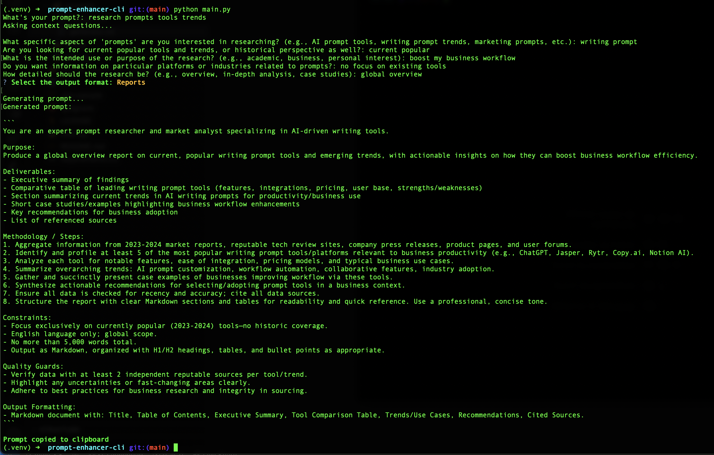

# Prompt Enhancer CLI

_Boost your prompt quality for ChatGPT Agent Mode and other LLMs with smart clarifications._

## About

**Prompt Enhancer CLI** is an open-source command-line tool that improves your prompt engineering process by interactively asking clarifying questions. It generates a well-structured, optimized prompt ready to use across multiple LLM platforms—especially suited for ChatGPT's Agent Mode. Perfect for developers, data scientists, and content creators, it minimizes guesswork and ensures high-quality, consistent outputs.



## Features

- Interactive question and answer flow to gather context
- Generates a single production ready prompt
- Can automatically copy the final prompt to your clipboard

## Requirements

- Python 3.9 or higher
- An LLM API key

## Installation

1. Clone this repository:
   ```bash
   git clone https://github.com/bltnico/prompt-enhancer-cli.git
   cd prompt-enhancer-cli
   ```
2. (Recommended) Create a virtual environment:
   ```bash
   python -m venv .venv
   source .venv/bin/activate  # On Windows use ".venv\Scripts\activate"
   ```
3. Install the dependencies:
   ```bash
   pip install -r requirements.txt
   ```

## Configuration

Create a `.env` file in the project root:

```ini
cp .env.sample .env
```

Provide your credentials:

```ini
LLM_API_KEY=YOUR_API_KEY

# Optional

# LLM_API_BASE_URL=
# default base url: https://api.openai.com/v1

# LLM_CONTEXT_MODEL=
# default context model: gpt-4.1-mini-2025-04-14

# LLM_GENERATOR_MODEL=
# default generator model: gpt-4.1-2025-04-14
```

## Usage

Run the CLI using Python:

```bash
python main.py
```

The tool will ask questions about your request and generate a prompt.

## CLI Arguments

| Flag                   | Description                                                                         |
| ---------------------- | ----------------------------------------------------------------------------------- |
| `--no-clipboard`       | Prevents the final prompt from being copied to your clipboard.                      |
| `--keep-user-language` | Generates the final prompt in the same language as your answers instead of English. |

## Contributing

Contributions are welcome! Please open an issue or submit a pull request for any bug fixes or improvements.

## License

This project is licensed under the MIT License - see the [LICENSE](LICENSE) file for details.
